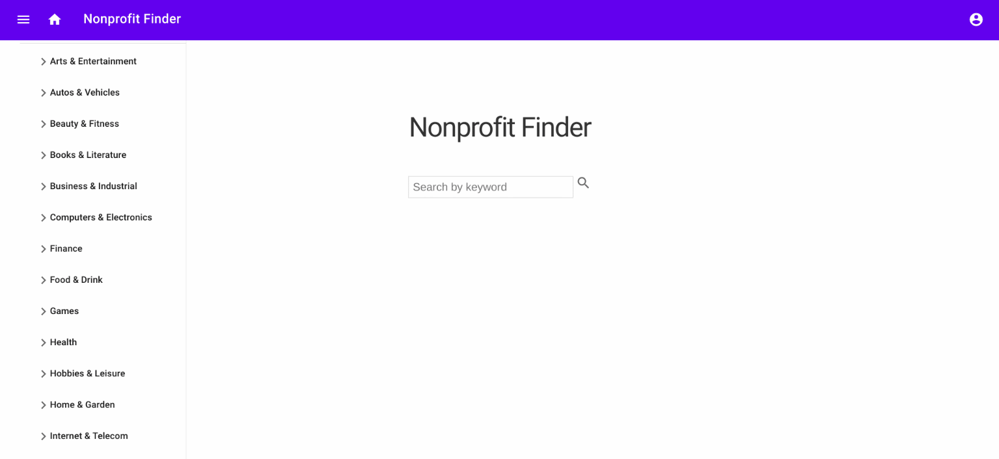
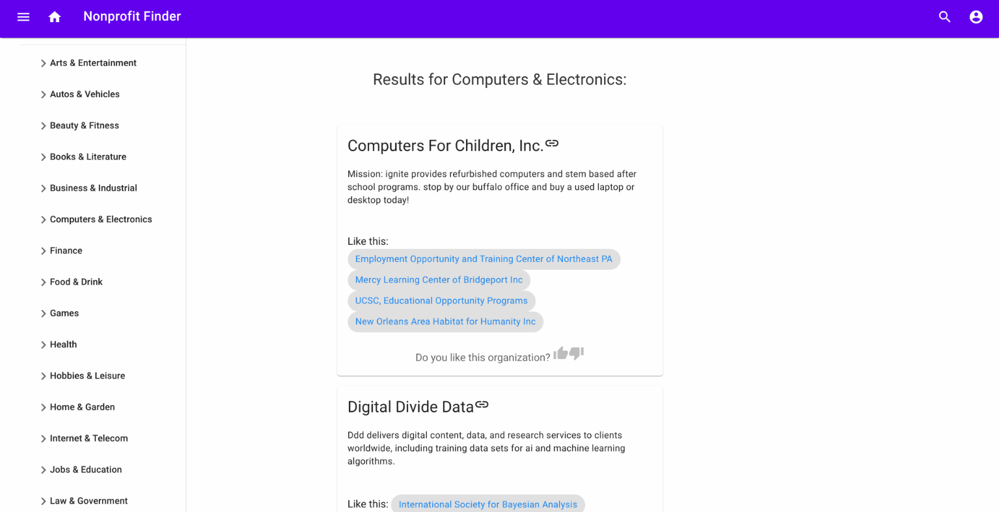
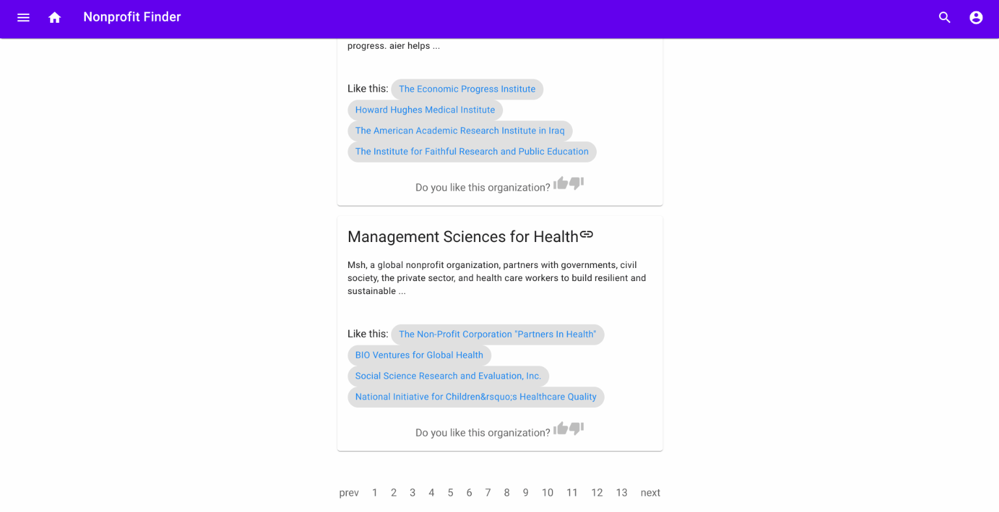
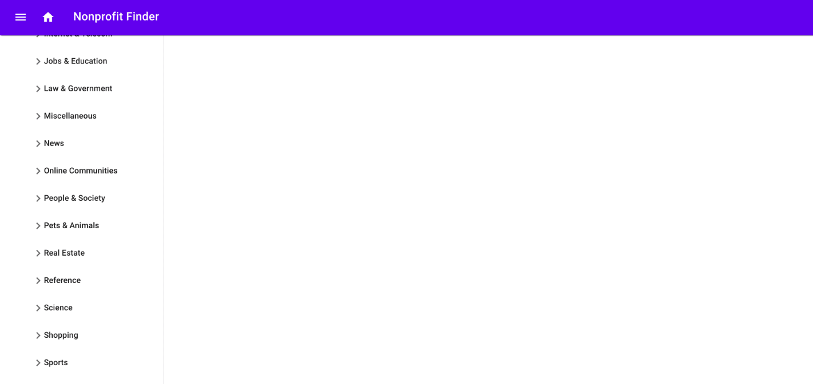
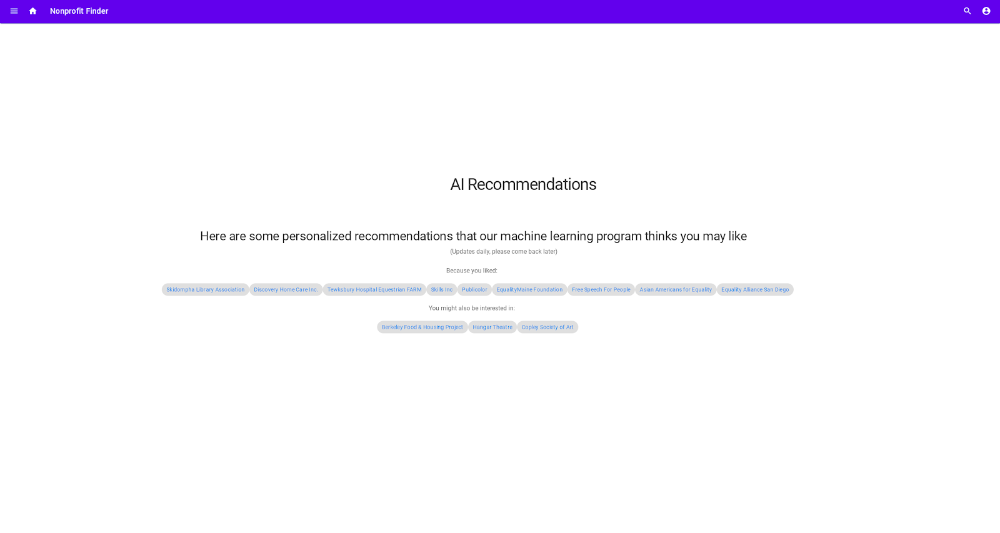

# Activism Platform - Nonprofit Finder

## Objective
The Activism Platform organizes and promotes activism by connecting users to nonprofit organizations:
  - Promote accessibility with searching for organizations feature
  - Promote impact and reach with recommending similar organizations feature
  - Promote relevancy with crowdsourcing from users feature

## Table of Contents
- [Objective](#Objective)
- [Features](#Features)
  - [Searching and Ranking](#Searching-and-Ranking)
    - [Search by Keyword](#Search-by-Keyword)
    - [Search by Category](#Search-by-Category)
    - [Ranking](#Ranking)
    - [Pagination](#Pagination)
  - [Machine Learning](#Machine-Learning)
    - [Text Similarity](#Text-Similarity)
    - [Collaborative Filter](#Collaborative-Filter)
- [Technology Stack](#Technology-Stack)

## Features
Here are some of the main features of our web app
### Searching and Ranking
Our searching functionality helps make organizations more accessible to users. You can search by keyword or by category.

#### Search by Keyword
Simply type in a keyword or key phrase of your interest in the search box and hit enter or click the search icon. It will then take you to the results page. You can search from any page of our website by clicking on the search icon on the top navigation bar.

#### Search by Category
Interested in a category of organizations? We got you! Powered by the [Google Cloud Natural Language](https://cloud.google.com/natural-language) Content classification, we have grouped organizations by their names and mission statements for your convenience. Click on the arrow on the side navigation bar to explore the categories, and click on a category's text to see organizations in that category.

#### Ranking
We value your opinion! If you like an organization, give it a thumbs up. If you dislike one, you can also give it a thumbs down to help other users. We rank the search results for either keyword or category by the net number of thumbs ups. Net thumbs ups = number of likes - number of dislikes, so go ahead and give your favorite nonprofit a thumbs up!

#### Pagination
Believe it or not, we have collected information on thousands of organizations for you! We only show 10 results per page. You can navigate through the other results with our intuitive pagination UI!

### Machine Learning
We use Machine Learning (ML) to recommend organizations that a user may like to promote impact and reach of nonprofits.
#### Text Similarity
We assigned each organization four other nonprofits that are "Like this." We achieved so with text similarity analysis on the names and mission statements of all of the organizations in our database. Here is our process for text similarity:
1. Remove stopwords (a, the, is etc.), number, and punctuations from sentences, and convert all text to lowercase
2. Lemmatize the sentences by grouping inflected forms of words together (i.e. "likes" is the same as "like")
3. Embeds sentences into weighted vectors with the [TensorFlow Universal Sentence Encoder](https://tfhub.dev/google/universal-sentence-encoder/4)
4. Train a k-Nearest Neighbor (k-NN) classifier on the weighted word vectors
5. Feed our model an input (name + mission statement of an organization) and let our ML model find most similar organizations to the input

#### Collaborative Filter
We can also make very personalized recommendations to users based on their ratings of organizations and other users' ratings. The idea is that people of similar interests are probably going to like the same organizations. Our collaborative filter not only captures the similarity among users, but also utilizes the [text similarity](#Text-Similarity) results from the previous section. Here is our workflow:
1. Fetch the user ratings: thumbs up is stored as 1.0 and thumbs down is stored as -1.0
2. Generate matrix with (number of organizations) rows and (number of users) columns
3. Fill unrated organizations in the matrix with ratings of similar (text similarity) organizations from the same user
4. Run Singular Value Decomposition (SVD) on the filled matrix, and for dimensionality reduction, only keep k most significant singular values
5. Recompose a matrix as our prediction
6. Find three new organizations with the highest predited ratings to recommend to each user

## Technology Stack
